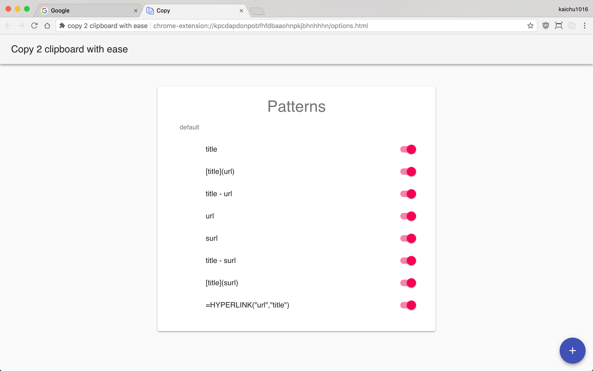
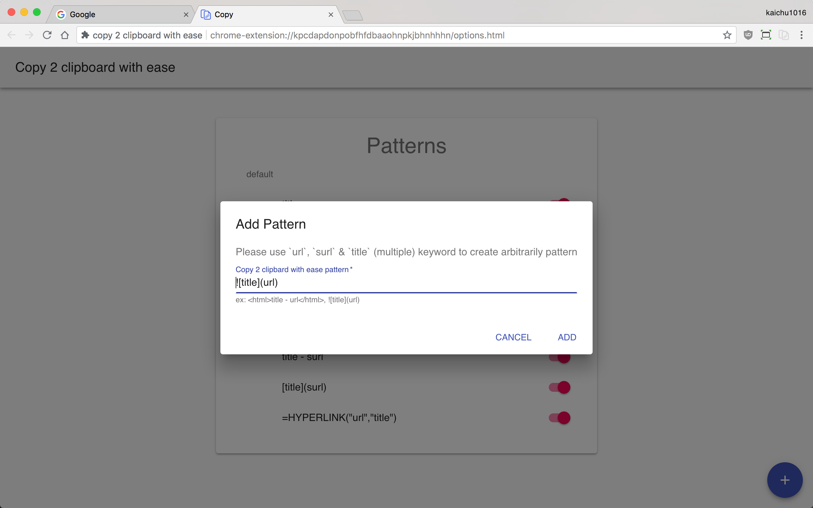
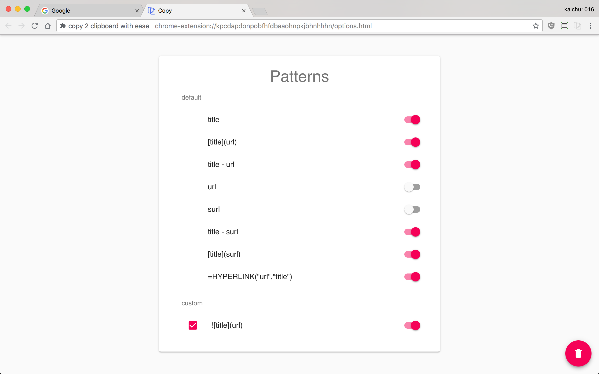
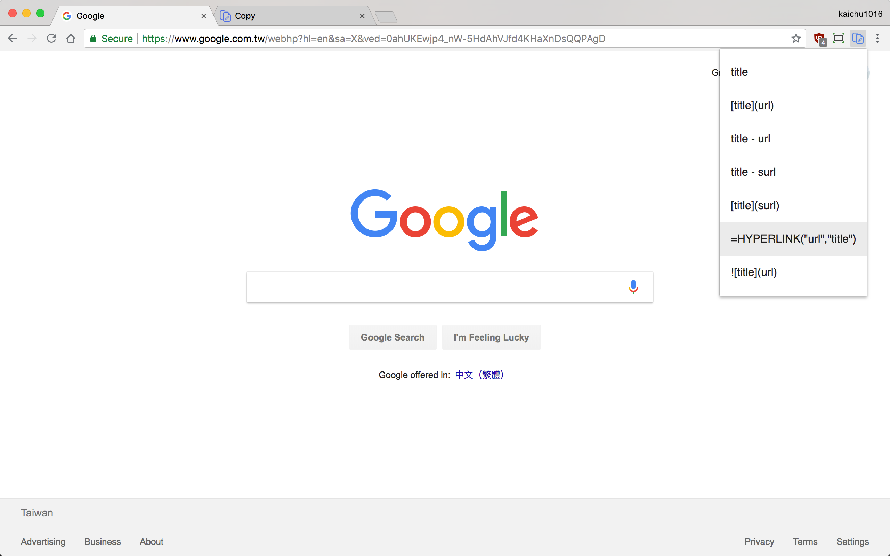
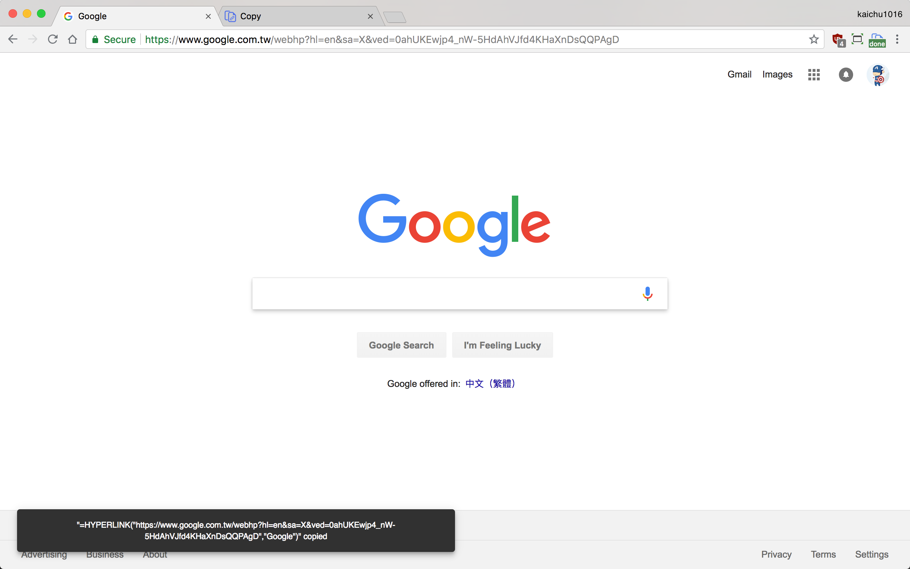
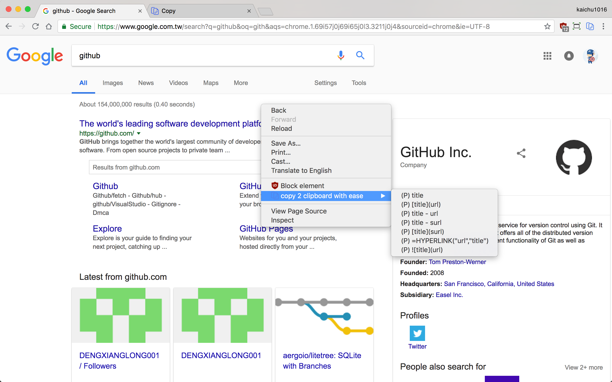
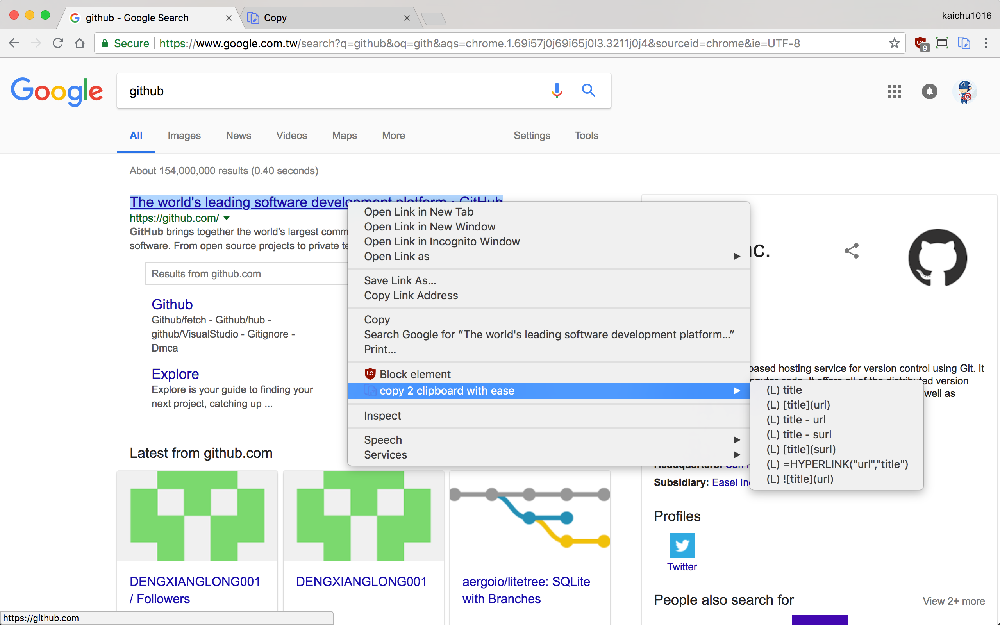

# copy 2 clipboard with ease v2

Fork from [The Minimal React Webpack Babel Setup](https://www.robinwieruch.de/minimal-react-webpack-babel-setup/)

## Features

A simple and quick way to copy title and url with ease in chrome browser.

* default has 8 copy pattern
    * `title`
    * `[title](url)`
    * `title - url`
    * `url`
    * `surl`
    * `title - surl`
    * `[title](surl)`
    * `=HYPERLINK("url","title")`
* create custom pattern with `url`, `surl` & `title` (multiple) keyword to create arbitrarily pattern
* enable/disable copy pattern you want
* contextMenu support

### Options Page

### Options Page: Create custom pattern

### Options page: Remove custom pattern, disable default/custom pattern

### Popup copy menu

### Snackbar show Copy result

### ContextMenu: copy page

### ContextMenu: copy link 

## Installation

[copy 2 clipboard with ease - Chrome Web Store](https://chrome.google.com/webstore/detail/copy-2-clipboard-with-eas/hiiobhaaokpmdmkkcaokdlanlemmcoah)
